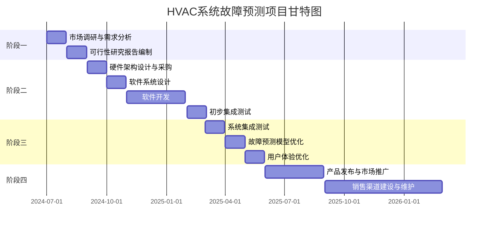

# 一、项目时间表

项目分为四个主要阶段，每个阶段包含若干任务，预期完成时间如下：

1. **阶段一：需求分析与可行性研究（1-2个月）**
   * 市场调研与需求分析（1个月）
   * 可行性研究报告编制（1个月）
2. **阶段二：系统设计与开发（3-6个月）**
   * 硬件架构设计与采购（1个月）
   * 软件系统设计（1个月）
   * 软件开发（3个月）
   * 初步集成测试（1个月）
3. **阶段三：系统测试与优化（2-3个月）**
   * 系统集成测试（1个月）
   * 故障预测模型优化（1个月）
   * 用户体验优化（1个月）
4. **阶段三：系统测试与优化（2-3个月）**
   * 产品发布与市场推广（3个月）
   * 销售渠道建设与维护（6-9个月）


# 二、资源分配

项目资源包括人力资源、硬件资源和软件资源。

1. **人力资源**
   * 项目经理：1名（全职）
   * 前端开发工程师：1名（全职）
   * 后端开发工程师：2名（全职）
   * 数据库工程师：1名（全职）
2. **硬件资源**
   * 服务器：5台
   * 网络设备：若干
   * 传感器设备：多套
3. **软件资源**
   * 开发工具：IDE、版本控制系统
   * 大数据处理平台：Hadoop、Spark等
   * 数据库：MySQL、HBase等
   * AI模型开发工具：TensorFlow、PyTorch等


# 三、里程碑

1. **阶段一完成**
   * 完成市场调研与需求分析
   * 可行性研究报告提交
2. **阶段二完成**
   * 硬件架构设计和采购完成
   * 完成软件系统设计和开发
   * 初步集成测试完成
3. **阶段三完成**
   * 系统集成测试完成
   * 故障预测模型优化完成
   * 用户体验优化完成
4. **阶段四完成**
   * 产品发布
   * 完成市场推广和销售渠道建设


# 四、预算

| **项目**     | **预算金额（人民币）** |
| ------------ | ---------------------- |
| 人力成本     | 400万                  |
| 硬件成本     | 100万                  |
| 软件成本     | 50万                   |
| 市场推广成本 | 150万                  |
| 运营成本     | 200万                  |
| 其他成本     | 100万                  |
| 总计         | 1000万                 |


# 五、风险管理表

| **风险类型** | **风险描述**                           | **可能性** | **影响程度** | **应对策略**                                         |
| ------------ | -------------------------------------- | ---------- | ------------ | ---------------------------------------------------- |
| 技术风险     | 技术实现难度较大，可能导致开发周期延长 | 中         | 高           | 加强研发团队建设，采用先进技术方案，灵活调整计划     |
| 市场风险     | 市场接受度不高，销售不理想             | 中         | 高           | 进行全面市场调研，精准定位目标市场，制定灵活营销策略 |
| 资金风险     | 资金不足，影响项目进度                 | 低         | 高           | 合理控制预算，积极寻求投资和政府支持                 |
| 人员风险     | 关键人员离职，影响项目进度和质量       | 低         | 中           | 建立合理的人才梯队，提供良好的激励机制               |
| 竞争风险     | 市场竞争激烈，竞争对手推出类似产品     | 高         | 中           | 强化产品优势，提升技术壁垒，快速响应市场变化         |




甘特图代码：

```cpp
gantt
    title HVAC系统故障预测项目甘特图

    section 阶段一：需求分析与可行性研究
    市场调研与需求分析 :2024-07-01, 30d
    可行性研究报告编制 :2024-08-01, 30d

    section 阶段二：系统设计与开发
    硬件架构设计与采购 :2024-09-01, 30d
    软件系统设计 :2024-10-01, 30d
    软件开发 :2024-11-01, 90d
    初步集成测试 :2025-02-01, 30d

    section 阶段三：系统测试与优化
    系统集成测试 :2025-03-01, 30d
    故障预测模型优化 :2025-04-01, 30d
    用户体验优化 :2025-05-01, 30d

    section 阶段四：市场推广与销售
    产品发布与市场推广 :2025-06-01, 90d
    销售渠道建设与维护 :2025-09-01, 180d
```

