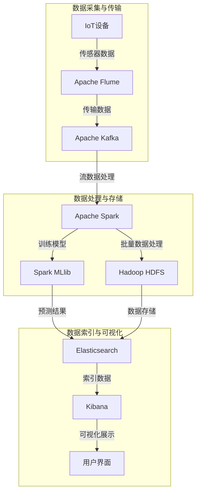

# 基于大数据架构的HVAC系统技术规范文档

- [基于大数据架构的HVAC系统技术规范文档](#基于大数据架构的hvac系统技术规范文档)
    - [1.项目概述](#1项目概述)
    - [2.系统架构](#2系统架构)
      - [2.1总体架构图](#21总体架构图)
    - [3. 技术选型和组件概述](#3-技术选型和组件概述)
      - [3.1 IoT设备集成](#31-iot设备集成)
      - [3.2 Apache Flume](#32-apache-flume)
      - [3.3 Apache Kafka](#33-apache-kafka)
      - [3.4 Apache Spark](#34-apache-spark)
      - [3.5 Spark MLlib](#35-spark-mllib)
      - [3.6 Hadoop HDFS](#36-hadoop-hdfs)
      - [3.7 Elasticsearch](#37-elasticsearch)
      - [3.8 Kibana](#38-kibana)
      - [3.9 用户界面（Web GUI）](#39-用户界面web-gui)
      - [3.10 模型评估与优化](#310-模型评估与优化)
    - [4. 系统实现细节](#4-系统实现细节)
      - [4.1 IoT设备集成](#41-iot设备集成)
      - [4.2 数据采集 - Apache Flume](#42-数据采集---apache-flume)
      - [4.3 消息队列 - Apache Kafka](#43-消息队列---apache-kafka)
      - [4.4 数据处理 - Apache Spark](#44-数据处理---apache-spark)
      - [4.5 机器学习模型 - Spark MLlib](#45-机器学习模型---spark-mllib)
      - [4.6 数据存储 - Hadoop HDFS](#46-数据存储---hadoop-hdfs)
      - [4.7 数据索引 - Elasticsearch](#47-数据索引---elasticsearch)
      - [4.8 数据可视化 - Kibana](#48-数据可视化---kibana)
      - [4.9 用户界面 - Web GUI](#49-用户界面---web-gui)
      - [4.10 模型评估与优化](#410-模型评估与优化)

### 1.项目概述

本项目旨在开发一个基于大数据架构的HVAC系统，用于实时监测和预测设备故障。系统通过集成多个技术组件，实现数据的采集、存储、处理、分析和可视化，为用户提供全面的设备状态监控和故障预测能力。

### 2.系统架构

#### 2.1总体架构图



```a
graph TD
    A[IoT设备] -->|传感器数据| B[Apache Flume]
    B -->|传输数据| C[Apache Kafka]
    C -->|流数据处理| D[Apache Spark]
    D -->|训练模型| E[Spark MLlib]
    D -->|批量数据处理| F[Hadoop HDFS]
    E -->|预测结果| G[Elasticsearch]
    F -->|数据存储| G[Elasticsearch]
    G -->|索引数据| H[Kibana]
    H -->|可视化展示| I[用户界面]
    subgraph 数据采集与传输
        A
        B
        C
    end
    subgraph 数据处理与存储
        D
        E
        F
    end
    subgraph 数据索引与可视化
        G
        H
        I
    end
```

### 3. 技术选型和组件概述

#### 3.1 IoT设备集成

- 功能：与HVAC系统的各种传感器和控制器进行集成，采集实时数据。
- 组件：IoT传感器设备。
- 说明：这些传感器可以监测温度、湿度、压力、能耗等多种参数，并通过无线或有线网络传输数据到数据采集系统。

#### 3.2 Apache Flume

- 功能：数据采集工具，从IoT设备收集传感器数据。
- 组件：Apache Flume。
- 说明：Flume用于从分布式的IoT设备实时收集数据，并将这些数据传输到Apache Kafka，以实现数据的高效传输和处理。

#### 3.3 Apache Kafka

- 功能：消息队列，用于缓冲Flume收集的数据，保证数据流的稳定性。
- 组件：Apache Kafka。
- 说明：Kafka提供了高吞吐量、低延迟的数据传输服务，确保数据能够可靠地传输到数据处理系统中。

#### 3.4 Apache Spark

- 功能：用于数据流处理和批量数据处理。
- 组件：Apache Spark。
- 说明：Spark可以处理实时数据流（Spark Streaming）和批量数据。它在处理数据的同时，还能与Spark MLlib集成，用于机器学习模型的训练和应用。

#### 3.5 Spark MLlib

- 功能：使用Spark的机器学习库来构建和训练故障预测模型。
- 组件：Spark MLlib。
- 说明：MLlib是Spark的机器学习库，支持多种机器学习算法。它可以用于训练预测模型，并在数据流中应用这些模型，实时预测HVAC系统的故障。

#### 3.6 Hadoop HDFS

- 功能：用于存储大规模数据集，提供数据持久化。
- 组件：Hadoop HDFS。
- 说明：HDFS是一个分布式文件系统，能够存储海量数据，并提供高可靠性和高吞吐量的数据访问。它是大数据存储的核心组件之一。

#### 3.7 Elasticsearch

- 功能：用于数据索引和快速检索，优化查询性能。
- 组件：Elasticsearch。
- 说明：Elasticsearch是一个分布式搜索引擎，可以对大规模数据进行实时搜索和分析。它能够快速检索存储在HDFS中的数据，并支持复杂的查询操作。

#### 3.8 Kibana

- 功能：用于数据可视化，帮助用户理解数据和预测结果。
- 组件：Kibana。
- 说明：Kibana与Elasticsearch集成，可以对Elasticsearch中的数据进行可视化展示。它提供丰富的图表和仪表盘功能，帮助用户直观地查看和分析数据。

#### 3.9 用户界面（Web GUI）

- 功能：展示实时数据和故障预测结果，并提供系统管理功能。
- 组件：Web应用程序框架（如React、Angular或Vue.js）。
- 说明：用户界面是系统的前端部分，提供与用户的交互界面。通过与后端服务交互，展示实时监测数据、预测结果，并提供系统配置和管理功能。

#### 3.10 模型评估与优化

- 功能：定期评估模型性能，并进行优化调整。
- 组件：定期调度的Spark作业和MLlib算法。
- 说明：通过定期调度的Spark作业对模型进行评估，利用MLlib的评估指标（如准确率、召回率等）分析模型性能，并根据需要调整和优化模型参数，以提高预测准确性。

### 4. 系统实现细节

#### 4.1 IoT设备集成

- 硬件选择：选择能够监测温度、湿度、压力、能耗等多种参数的传感器。
- 连接和通信：使用无线（如Wi-Fi、Zigbee）或有线（如以太网）网络连接传感器。确保传感器数据能够被采集到网关设备（如Raspberry Pi或专用IoT网关）。
- 数据格式和协议：传感器数据通常使用标准协议（如MQTT、CoAP）进行传输。数据格式可以是JSON、XML或二进制格式。

#### 4.2 数据采集 - Apache Flume

- 安装与配置：在网关设备或边缘服务器上安装Apache Flume。配置Flume的源（Source）以从IoT设备接收数据，通道（Channel）用于临时存储数据，汇（Sink）将数据发送到Kafka。
- 数据传输：设置Flume源为HTTP源或自定义源以接收传感器数据。通道可以使用内存通道或文件通道。汇配置为Kafka汇，将数据发送到Kafka集群中的特定主题。

#### 4.3 消息队列 - Apache Kafka

- 安装与配置：在集群上安装并配置Apache Kafka。配置Kafka代理（Broker）以确保高可用性和故障恢复。
- 创建主题：创建用于接收传感器数据的Kafka主题（Topics）。根据数据类型和优先级，创建不同的主题。
- 数据消费：配置消费者（Consumer）从Kafka主题中读取数据，并将数据传递给下游处理系统。

#### 4.4 数据处理 - Apache Spark

- 安装与配置：在集群上安装Apache Spark，配置Spark集群和Spark Streaming。
- 实时数据处理：使用Spark Streaming从Kafka主题中实时读取数据。编写Spark Streaming应用程序，处理传感器数据（如清洗、过滤、聚合）。
- 批量数据处理：使用Spark Core进行批量数据处理任务，定期从HDFS中读取数据进行分析和计算。

#### 4.5 机器学习模型 - Spark MLlib

- 数据预处理：对传感器数据进行预处理（如归一化、缺失值处理、特征提取）。
- 模型训练：使用Spark MLlib的机器学习算法（如决策树、随机森林、支持向量机）训练故障预测模型。将处理后的数据用于模型训练，并保存训练好的模型。
- 模型应用：在Spark Streaming中应用训练好的模型，实时预测设备故障。

#### 4.6 数据存储 - Hadoop HDFS

- 安装与配置：在集群上安装Hadoop HDFS，配置NameNode和DataNode。
- 数据存储：将处理后的数据（原始数据和预测结果）存储在HDFS中。使用HDFS提供的API进行数据的读写操作。

#### 4.7 数据索引 - Elasticsearch

- 安装与配置：在集群上安装并配置Elasticsearch。配置集群节点和索引设置。
- 数据索引：编写数据管道，将HDFS中的数据同步到Elasticsearch中。可以使用Logstash或自定义应用程序完成数据索引。
- 查询优化：配置Elasticsearch的索引映射和分片设置，以优化查询性能。

#### 4.8 数据可视化 - Kibana

- 安装与配置：在集群上安装Kibana，并与Elasticsearch集成。
- 仪表盘配置：创建Kibana仪表盘，展示实时数据和预测结果。配置图表和报表，帮助用户理解数据。
- 报警和通知：配置Kibana报警功能，根据预测结果设置报警规则，并通过电子邮件或短信通知用户。

#### 4.9 用户界面 - Web GUI

- 前端开发：使用现代Web开发框架（如React、Angular、Vue.js）开发用户界面。创建用户友好的仪表盘，展示实时数据、历史数据和预测结果。
- 后端开发：使用Node.js、Django或Flask等后端框架开发API服务。API服务与Kafka、Spark、Elasticsearch集成，提供数据查询和管理功能。
- 用户认证和权限：实现用户认证（如OAuth2）和权限管理，确保系统安全。

#### 4.10 模型评估与优化

- 定期评估：定期调度Spark作业，评估模型性能。使用MLlib提供的评估指标（如准确率、召回率、F1分数）分析模型表现。
- 模型优化：根据评估结果，调整模型参数或选择不同的算法。可以使用超参数调优技术（如网格搜索、随机搜索）优化模型性能。
- 自动化部署：使用CI/CD工具（如Jenkins、GitLab CI）实现模型的自动化部署和更新，确保最新的预测模型能够及时应用于生产环境。
