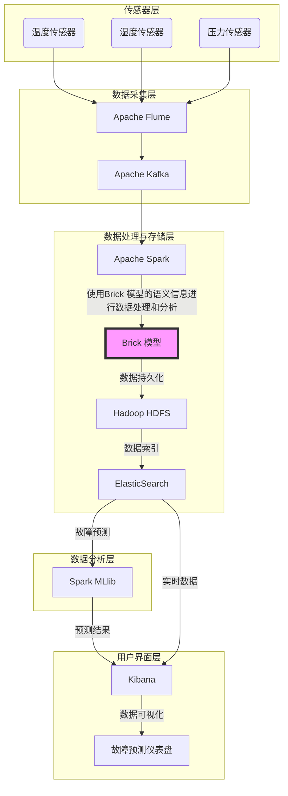
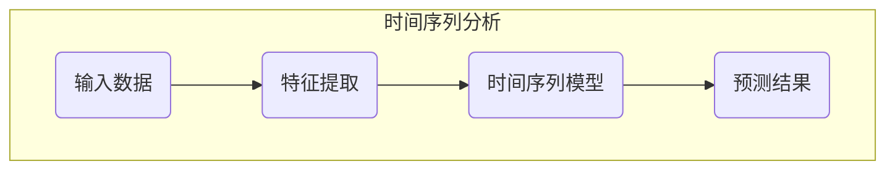
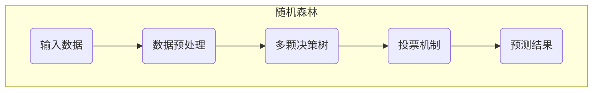
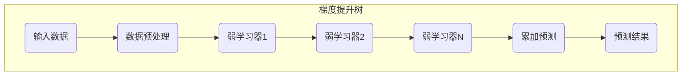
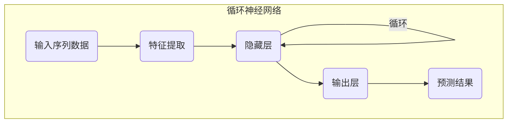
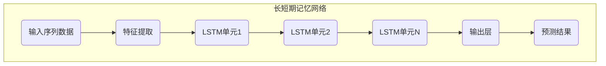
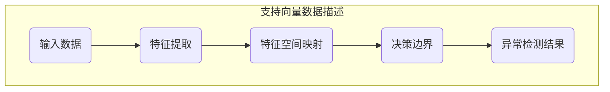

# HVAC系统设计文档

## 目录

1. **简介**
2. 系统概述
   1. 系统功能
   2. 设计目标
3. **架构概述**
4. 组件描述
   1. 传感器层
   2. 数据采集层
   3. 数据处理与存储层
   4. 数据分析层
   5. 用户界面层
5. **数据流**
6. 算法选型与比较
   1. 时间序列分析
   2. 随机森林
   3. 梯度提升树
   4. 循环神经网络（RNN）
   5. 长短期记忆网络（LSTM）
   6. 支持向量数据描述（SVDD）
7. **系统接口**
8. **系统管理**
9. **总结**

------

## 1. 简介

本系统旨在开发一个基于大数据架构的HVAC（Heating, Ventilation, and Air Conditioning）系统，用于实时监测和预测设备故障。通过对设备传感器数据的实时采集、存储、分析，系统能够提前预警潜在的设备问题，提供及时的故障预测和维护建议。

## 2. 系统概述

### 2.1 系统功能

1. 实时采集HVAC设备传感器数据。
2. 存储并管理大量传感器数据。
3. 实时数据分析与处理。
4. 故障预测与预警。
5. 提供用户友好的Web界面，展示实时数据和预测结果。

### 2.2 设计目标

- 高效的数据采集和传输。
- 可靠的数据存储和管理。
- 高精度的故障预测模型。
- 用户友好的数据展示界面。
- 易于扩展和维护的系统架构。

## 3. 架构概述



系统采用分层架构设计，主要包括以下几个层次：

1. **传感器层**：负责采集HVAC设备的实时运行数据。
2. **数据采集层**：使用Apache Flume和Apache Kafka进行数据采集和传输。
3. **数据处理与存储层**：基于Apache Spark和Hadoop HDFS进行数据处理和存储,  使用Elastic Search进行数据检索。
4. **数据分析层**：利用Spark MLlib进行故障预测和分析。
5. **用户界面层**：使用Kibana进行数据展示和用户交互。

## 4. 组件描述

### 4.1 传感器层

- **传感器类型**：温度传感器、湿度传感器、压力传感器等。
- **功能**：实时监测HVAC设备的运行状态，并将数据发送至数据采集层。

### 4.2 数据采集层

- **Apache Flume**：用于从传感器收集数据，具有高可扩展性和可靠性。
- **Apache Kafka**：用于数据的实时传输，支持高吞吐量和低延迟的数据流处理。

### 4.3 数据处理与存储层

- **Apache Spark**：用于实时数据处理和分析，支持大规模数据的分布式计算。
- **Hadoop HDFS**：用于存储大量的传感器数据，提供高可用性和容错性。
- **Elastic Search**:  用于数据索引和快速检索，优化查询性能。

### 4.4 数据分析层

- **Spark MLlib**：用于实现故障预测模型，包括随机森林、梯度提升树、RNN、LSTM和SVDD等算法。

### 4.5 用户界面层

- **Kibana**：用于展示实时数据和预测结果，提供用户友好的可视化界面。

## 5. 数据流

1. **数据采集**：传感器实时采集HVAC设备数据，通过Apache Flume发送到Kafka。
2. **数据传输**：Kafka将数据传输到Apache Spark进行实时处理。
3. **数据存储**：处理后的数据存储在Hadoop HDFS中。
4. **数据分析**：Spark MLlib从ElasticSearch检索数据，进行故障预测分析。
5. **数据展示**：分析结果通过Kibana展示给用户。

## 6. Brick 模型的理解和植入
Brick 模型用于标准化和语义化描述HVAC系统中的设备、位置和系统关系。通过Brick模型，可以实现对设备和数据的统一管理和查询。

### 6.1 Brick 模型概述
Brick 模型使用 RDF 和 SPARQL 来描述建筑物内设备、位置、系统和数据的语义关系。以下是 Brick 模型的基本组成：

设备 (Devices)：如温度传感器、湿度传感器等。
位置 (Locations)：如房间、楼层等。
系统 (Systems)：如HVAC系统、电力系统等。
属性 (Attributes)：如温度、湿度等。

### 6.2 Brick 模型在本课题中的应用
在本课题中，Brick 模型用于描述HVAC系统中的各类设备及其数据。

定义设备和位置：使用 Brick 模型定义 HVAC 系统中的设备和位置。
数据采集和描述：使用 Brick 模型描述采集到的传感器数据。
数据处理和分析：使用 Brick 模型的语义信息进行数据处理和分析。
数据展示：使用 Kibana 结合 Brick 模型实现数据的语义查询和展示。

### 6.3 Brick 模型应用示例
```turtle
@prefix brick: <https://brickschema.org/schema/1.0.3/Brick#> .
@prefix ex: <http://example.com#> .

ex:Building_A a brick:Building ;
    brick:hasPart ex:Floor_1 .

ex:Floor_1 a brick:Floor ;
    brick:hasPart ex:Room_101 ;
    brick:hasPart ex:Room_102 .

ex:Room_101 a brick:Room ;
    brick:hasPart ex:TempSensor_1 ;
    brick:hasPart ex:HumidSensor_1 .

ex:TempSensor_1 a brick:Temperature_Sensor ;
    brick:hasLocation ex:Room_101 ;
    brick:hasUnit "Celsius" .

ex:HumidSensor_1 a brick:Humidity_Sensor ;
    brick:hasLocation ex:Room_101 ;
    brick:hasUnit "Percent" .
```

## 7. 算法选型与比较

### 7.1 时间序列分析




#### 优点

- **趋势捕捉**：能够捕捉数据中的时间趋势和季节性变化。
- **简单易用**：模型相对简单，易于实现和解释。
- **快速训练**：训练时间相对较短，计算复杂度低。

#### 缺点

- **线性假设**：假设数据的变化是线性的，难以处理复杂的非线性关系。
- **长期依赖**：对长时间依赖的处理能力有限，难以捕捉远距离的依赖关系。

#### 适用场景

- 适用于数据趋势明显且变化相对平稳的场景，如温度、湿度等变化预测。

### 7.2 随机森林




#### 优点

- **高准确率**：通过集成多个决策树，具有较高的预测准确率。
- **抗过拟合**：通过引入随机性，减小过拟合风险，增强模型的泛化能力。
- **处理高维数据**：能够处理大量特征和高维数据。

#### 缺点

- **计算量大**：模型复杂度高，训练时间较长。
- **可解释性差**：结果难以解释，无法提供明确的决策路径。

#### 适用场景

- 适用于复杂性较高、特征较多的数据集，尤其是当数据特征之间存在非线性关系时。

### 7.3 梯度提升树（Gradient Boosting Tree, GBT）




#### 优点

- **高精度**：通过逐步优化模型误差，能够获得高精度的预测结果。
- **处理非线性关系**：能够处理数据中的复杂非线性关系。
- **可调整性强**：参数丰富，适应性强，能够根据具体需求进行调整。

#### 缺点

- **训练时间长**：由于模型是逐步优化的，训练时间相对较长。
- **参数调节复杂**：需要仔细调整参数以获得最佳性能。

#### 适用场景

- 适用于需要高精度预测且能够接受较长训练时间的场景，特别是在数据关系复杂的情况下。

### 7.4 循环神经网络（RNN）




#### 优点

- **序列处理**：能够处理序列数据，捕捉时间上的依赖关系。
- **时间依赖**：适用于捕捉短期时间依赖关系，适合时间序列预测。

#### 缺点

- **梯度消失**：在处理长时间依赖关系时，易出现梯度消失问题。
- **计算复杂度高**：训练时间较长，对计算资源要求高。

#### 适用场景

- 适用于短期时间序列数据的预测，如短时间内的设备状态变化。

### 7.5 长短期记忆网络（LSTM）




#### 优点

- **长时间依赖**：通过引入记忆单元，有效解决RNN的梯度消失问题，能够捕捉长时间依赖关系。
- **适用广泛**：适用于各种序列数据的预测，具有较强的适应性。

#### 缺点

- **结构复杂**：模型结构复杂，训练时间较长。
- **计算资源高**：对计算资源要求较高，需要较大的计算能力和内存。

#### 适用场景

- 适用于长时间序列数据的预测，如设备的长期运行状态监测和故障预测。

### 7.6 支持向量数据描述（SVDD）




#### 优点

- **异常检测**：专门用于异常检测，能够有效识别异常数据点。
- **小样本处理**：适用于小样本数据，训练数据需求量少。

#### 缺点

- **参数调节复杂**：对参数调节要求高，难以找到最优参数。
- **计算复杂度高**：计算复杂度较高，训练时间较长。

#### 适用场景

- 适用于设备异常检测和故障预警，特别是在数据量较小的情况下。

### 7.7 选型综述

综合考虑数据特性和系统需求，本HVAC系统需对设备传感器数据进行实时监测和故障预测，数据具有明显的时间序列特性且需要处理长时间的依赖关系。因此，以下几点是算法选型的关键考虑因素：

1. **处理时间序列数据的能力**：算法需能够处理和分析时间序列数据。
2. **长时间依赖关系的捕捉**：需要捕捉设备运行过程中的长时间依赖关系。
3. **高预测准确率**：对故障预测要求高精度，以减少误报和漏报。

基于以上分析，长短期记忆网络（LSTM）是较为适合的选择。LSTM在处理时间序列数据时表现优异，能够有效捕捉长时间的依赖关系，适用于HVAC系统的故障预测任务。此外，LSTM在实践中已被广泛应用于各种预测任务，证明了其稳定性和高效性。

虽然LSTM的训练时间较长且对计算资源要求高，但其带来的高预测准确率和稳定性足以弥补这些不足。因此，建议在本系统中采用LSTM作为主要的故障预测模型，以实现对HVAC设备故障的精准预测和及时预警。

## 8. 系统接口


### 8.1.数据采集接口

#### **IoT设备集成接口**

##### getSensorData(sensorType, sensorId)

  用于从指定传感器获取实时数据。

  - 参数说明：
    - sensorType：传感器类型（温度、湿度、压力等）
    - sensorId：传感器ID
  - 返回值类型：传感器数据或错误信息

##### configureSensor(sensorType, sensorId, configParams)

  用于配置指定传感器的参数。

  - 参数说明：
    - sensorType：传感器类型（温度、湿度、压力等）
    - sensorId：传感器ID
    - configParams：配置参数
  - 返回值类型：True(配置成功)或 False(配置失败)

#### **Apache Flume接口**

##### flumeSourceSetup(sourceType, sourceConfig)

  设置Flume的Source，指定数据源类型及其配置。

  - 参数说明：
    - sourceType：数据源类型
    - sourceConfig：数据源配置
  - 返回值类型：True(设置成功)或 False(设置失败)

##### flumeSinkSetup(sinkType, sinkConfig)

  设置Flume的Sink，指定目标系统及其配置。

  - 参数说明：
    - sinkType：目标系统类型
    - sinkConfig：目标系统配置
  - 返回值类型：True(设置成功)或 False(设置失败)

### 8.2.数据处理接口

#### **Apache Kafka接口**

##### kafkaProduce(topic, message)

  将消息发送到Kafka的指定主题。

  - 参数说明：
    - topic：Kafka主题
    - message：要发送的消息（必须是Brick格式）
  - 返回值类型：True(发送成功)或 False(发送失败)

##### kafkaConsume(topic, groupId)

  从Kafka的指定主题中消费消息。

  - 参数说明：
    - topic：Kafka主题
    - groupId：消费者组ID
  - 返回值类型：消费到的消息（Brick格式）或错误信息

#### **Apache Spark接口**

##### sparkStreamProcess(kafkaParams, processingFunc)

  使用Spark Streaming处理Kafka数据流。

  - 参数说明：
    - kafkaParams：Kafka参数
    - processingFunc：处理函数（处理Brick格式的数据）
  - 返回值类型：True(处理成功)或 False(处理失败)

##### sparkSQLQuery(query)

  执行Spark SQL查询。

  - 参数说明：
    - query：SQL查询语句（查询的数据为Brick格式）
  - 返回值类型：查询结果或错误信息

#### **spark MLlib接口**

##### trainModel(trainingData, modelParams)

  使用Spark MLlib训练预测模型。

  - 参数说明：
    - trainingData：训练数据（Brick格式）
    - modelParams：模型参数
  - 返回值类型：训练好的模型或错误信息

##### predictData(model, inputData)

  使用训练好的模型进行预测。

  - 参数说明：
    - model：训练好的模型
    - inputData：输入数据（Brick格式）
  - 返回值类型：预测结果或错误信息

### 8.3.数据存储接口

#### Hadoop HDFS接口

##### storeData(filePath, data)

  将数据存储到HDFS指定路径。

  - 参数说明：
    - filePath：存储路径
    - data：要存储的数据（Brick格式）
  - 返回值类型：True(存储成功)或 False(存储失败)

##### readData(filePath)

  从HDFS指定路径读取数据。

  - 参数说明：
    - filePath：存储路径
  - 返回值类型：读取到的数据（Brick格式）或错误信息

#### Elasticsearch接口

##### indexData(indexName, data)

  将数据索引到Elasticsearch的指定索引中。

  - 参数说明：
    - indexName：索引名称
    - data：要索引的数据（Brick格式）
  - 返回值类型：True(索引成功)或 False(索引失败)

##### searchData(indexName, query)

  在Elasticsearch的指定索引中进行搜索。

  - 参数说明：
    - indexName：索引名称
    - query：查询条件
  - 返回值类型：查询结果或错误信息

### 8.4.用户界面接口

#### Kibana接口

##### createDashboard(dashboardName, visualizations)

  创建Kibana仪表板，指定仪表板名称和可视化组件。

  - 参数说明：
    - dashboardName：仪表板名称
    - visualizations：可视化组件列表
  - 返回值类型：True(创建成功)或 False(创建失败)

##### updateVisualization(visualizationId, newConfig)

  更新Kibana的可视化组件配置。

  - 参数说明：
    - visualizationId：可视化组件ID
    - newConfig：新配置
  - 返回值类型：True(更新成功)或 False(更新失败)

### 8.5. 模型评估与优化接口

##### evaluateModel(model, testData)

  评估模型性能，返回评估结果。

  - 参数说明：
    - model：要评估的模型
    - testData：测试数据（Brick格式）
  - 返回值类型：评估结果或错误信息

##### optimizeModel(model, optimizationParams)

  根据优化参数调整和优化模型。

  - 参数说明：
    - model：要优化的模型
    - optimizationParams：优化参数
  - 返回值类型：优化后的模型或错误信息

## 9. 系统管理

### 9.1 系统配置

- **配置文件管理**：管理各组件的配置文件，包括Flume、Kafka、Spark、HDFS和Kibana。
- **系统监控**：实时监控系统运行状态，确保系统的高可用性。

### 9.2 数据管理

- **数据清理**：定期清理过期和无效数据，确保存储空间的高效利用。
- **数据备份与恢复**：提供数据备份和恢复机制，确保数据的安全性和可靠性。

### 9.3 模型管理

- **模型训练**：定期训练和更新故障预测模型，确保预测的准确性。
- **模型评估**：定期评估模型性能，确保模型的有效性。

## 10. 总结

本系统通过多层架构设计，实现了HVAC系统的实时监测和故障预测。采用Apache Flume、Apache Kafka、Apache Spark、Hadoop HDFS和Kibana等技术，实现了高效的数据采集、传输、存储、分析和展示。综合比较不同的故障预测算法，选用长短期记忆网络（LSTM）作为预测模型，能够有效提高故障预测的准确性和及时性。系统设计充分考虑了可扩展性、可维护性和用户体验，提供了完整的接口和管理机制，确保系统的高效运行。


